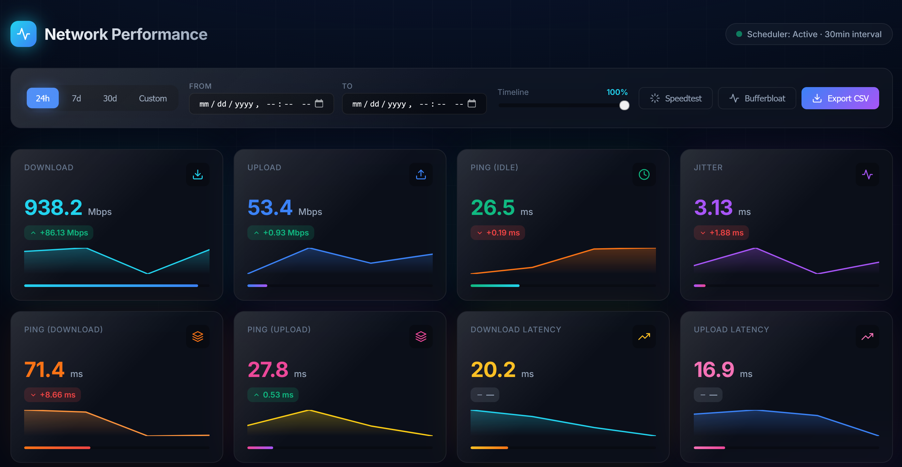
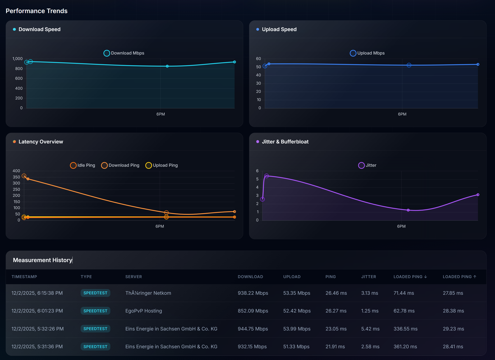

# 🚀 NetWatch - Self-Hosted Network Monitor

<p align="center">
  
</p>

<p align="center">
  
  
  
  
  
</p>

A beautiful, self-hosted network performance monitoring dashboard with real-time speedtest measurements, bufferbloat detection, internal network (Homenet) testing, and historical trend analysis. Built with Flask and featuring a modern glass-morphism UI.

## ✨ Features

### 📊 Internet Performance Monitoring
- **Ookla Speedtest Integration** - Automatic binary download and execution
- **Bufferbloat Testing** - iperf3-based latency under load measurements
- **8 Key Metrics** - Download, Upload, Ping (Idle), Jitter, Loaded Latency (↓/↑), Download/Upload Latency
- **Real-time Updates** - Live dashboard with animated metrics and sparklines

### 🏠 Homenet - Internal Network Monitoring (NEW in v1.3.0)
- **Built-in Speedtest Server** - Python-based server on port 5201 for LAN testing
- **Device Discovery** - Automatic scanning of network devices via ARP/ping
- **LAN & WiFi Device Tracking** - Separate charts and stats by connection type
- **Bufferbloat Analysis** - Idle Ping vs Loaded Ping vs Gateway Ping chart
- **Device Management** - Name devices, view history, track performance over time
- **Auto-Registration** - Devices running tests are automatically added
- **Gateway Ping** - Monitor latency to your router
- **Live Test Progress** - Real-time waveform visualization during tests

### 📈 Data Visualization
- **Interactive Charts** - Time-series graphs with Chart.js
- **Trend Analysis** - 24h, 7d, 30d, and custom date ranges
- **Global Timeline Slider** - Synchronize all charts to specific time windows
- **Historical Data Table** - Searchable, sortable measurement history

### ⚙️ Advanced Scheduler Configuration
- **3 Scheduling Modes:**
  - **Simple** - 24/7 monitoring with configurable interval (5-120 min)
  - **Weekly** - Select active weekdays with time windows
  - **Advanced** - Per-day custom schedules with multiple time slots
- **Multiple Time Slots** - Add multiple measurement windows per day (e.g., 4am-10am, then 10pm-midnight)
- **Server-Side Storage** - Configuration syncs across all devices
- **Manual Triggers** - On-demand speedtest and bufferbloat tests

### 💾 Data Management
- **SQLite Storage** - Lightweight, file-based database
- **CSV Export** - Filtered and complete dataset exports
- **Raw JSON Logging** - Complete measurement data preservation
- **Delta Tracking** - Automatic comparison with previous measurements

### 🎨 Modern UI
- **Glass-morphism Design** - Frosted glass effects inspired by shadcn/ui
- **Responsive Layout** - Mobile-friendly adaptive design
- **Dark Theme** - Easy on the eyes with gradient backgrounds
- **Toast Notifications** - Real-time feedback for user actions
- **Animated Metrics** - Count-up animations and progress bars

## 📸 Screenshots

### Dashboard
<p align="center">
  
  
</p>

### Homenet - Internal Network Monitoring
<p align="center">
  
  
  
</p>

**Homenet Features:**
- **Device Overview** (left): Discovered network devices with LAN/WiFi indicators
- **Speed Charts** (center): Per-device speed history with download/upload trends
- **Bufferbloat Analysis** (right): Idle Ping vs Loaded Ping vs Gateway Ping comparison

### Scheduler Configuration
<p align="center">
  
  
  
</p>

**Scheduling Modes:**
- **Simple** (left): Run measurements 24/7 with a fixed interval
- **Weekly** (center): Select specific weekdays and time windows
- **Advanced** (right): Configure multiple time slots per day for granular control

## 🚀 Quick Start

### Prerequisites
- Python 3.10 or higher
- pip (Python package manager)
- Internet connection (for Ookla binary download)
- **Optional:** iperf3 (for bufferbloat tests - not required for homenet tests)

### Installation

#### 🐧 Linux - Automated Installation (Recommended)

Install NetWatch as a **systemd service** for production use:

```bash
# Clone the repository
git clone https://github.com/c4g7-dev/netwatch.git
cd netwatch

# Run the Linux installer (requires sudo)
sudo bash install-linux.sh
```

**📖 [Full Linux Setup Guide →](LINUX-GUIDE.md)** - Service management, firewall, troubleshooting, and more

The installer will:
- ✅ Install system dependencies (python3-venv, iperf3)
- ✅ Create dedicated `netwatch` user
- ✅ Install to `/opt/netwatch`
- ✅ Set up Python virtual environment
- ✅ Download Ookla Speedtest CLI binary
- ✅ Configure systemd service
- ✅ Start NetWatch automatically

**Service Management:**
```bash
# Check status
systemctl status netwatch

# View live logs
journalctl -u netwatch -f

# Restart service
sudo systemctl restart netwatch

# Stop service
sudo systemctl stop netwatch

# Disable auto-start
sudo systemctl disable netwatch
```

#### 🪟 Windows / 💻 Manual Installation

```bash
# Clone the repository
git clone https://github.com/c4g7-dev/netwatch.git
cd netwatch

# Create virtual environment
python -m venv .venv

# Activate virtual environment
# Windows:
.venv\Scripts\activate
# Linux/macOS:
source .venv/bin/activate

# Install dependencies
pip install -r requirements.txt

# Run the installer
python installer.py

# Start the application
python main.py
```

### 🏃 Running NetWatch

#### Production (Linux with systemd)
NetWatch runs automatically as a service. Access at: **http://your-server-ip:8000**

#### Development / Windows
```bash
# Activate virtual environment
# Windows:
.venv\Scripts\activate
# Linux/macOS:
source .venv/bin/activate

# Start the server
python main.py
```

The dashboard will be available at: **http://localhost:8000**

### 🔒 Linux Firewall Configuration

```bash
# UFW (Ubuntu/Debian)
sudo ufw allow 8000/tcp

# firewalld (CentOS/RHEL/Fedora)
sudo firewall-cmd --permanent --add-port=8000/tcp
sudo firewall-cmd --reload

# iptables
sudo iptables -A INPUT -p tcp --dport 8000 -j ACCEPT
sudo iptables-save
```

## 📁 Project Structure

```
netwatch/
├── app/
│   ├── db/                    # Database models and session management
│   ├── measurements/          # Speedtest and bufferbloat runners
│   ├── web/                   # Flask application and routes
│   │   ├── static/
│   │   │   ├── css/          # Glass-morphism styles
│   │   │   └── js/           # Dashboard logic and charts
│   │   └── templates/        # HTML templates
│   ├── config.py             # Configuration loader
│   └── scheduler.py          # Automated measurement scheduling
├── bin/                      # Downloaded binaries (speedtest, iperf3)
├── data/                     # SQLite database and CSV exports
├── logs/                     # Application logs
├── config.yaml              # User configuration
├── installer.py             # Automated setup script
├── updater.py               # Binary update utility
├── main.py                  # Application entry point
└── requirements.txt         # Python dependencies
```

## ⚙️ Configuration

Edit `config.yaml` to customize NetWatch:

```yaml
# Server Configuration
web:
  host: "0.0.0.0"
  port: 8000

# Measurement Settings
ookla:
  auto_download: true

bufferbloat:
  iperf_server: iperf3.example.net
  iperf_port: 5201

# Logging
logging:
  level: "INFO"
```

> **Note:** Scheduling is now configured through the dashboard UI. Click the ⚙️ button next to the scheduler status to configure measurement intervals and time windows.

## 🔧 Advanced Usage

### 🐧 Linux Cron Jobs (Alternative to systemd)

If you prefer cron over systemd:

```bash
# Edit crontab
crontab -e

# Add this line to run speedtest every 30 minutes
*/30 * * * * /opt/netwatch/.venv/bin/python /opt/netwatch/main.py --run-once >> /opt/netwatch/logs/cron.log 2>&1

# Or run the Flask server in the background (not recommended)
@reboot cd /opt/netwatch && /opt/netwatch/.venv/bin/python main.py >> /opt/netwatch/logs/app.log 2>&1 &
```

**Note:** Using systemd is recommended over cron for better process management, automatic restarts, and proper logging.

### Manual Test Triggers

**Via Dashboard:**
- Click "Speedtest" button for immediate speed measurement
- Click "Bufferbloat" button for latency-under-load test

**Via API:**
```bash
# Trigger speedtest
curl -X POST http://localhost:8000/api/manual/speedtest

# Trigger bufferbloat test
curl -X POST http://localhost:8000/api/manual/bufferbloat
```

### Data Export

**Via Dashboard:**
- Click "Export CSV" to download filtered data based on current time range

**Via API:**
```bash
# Export all data
curl "http://localhost:8000/api/export/csv?scope=complete" -o measurements.csv

# Export filtered data
curl "http://localhost:8000/api/export/csv?start=2025-12-01T00:00:00Z&end=2025-12-02T23:59:59Z" -o measurements.csv
```

### API Endpoints

#### Internet Monitoring
| Endpoint | Method | Description |
|----------|--------|-------------|
| `/` | GET | Dashboard UI |
| `/api/status` | GET | System status and configuration |
| `/api/summary/latest` | GET | Latest measurement with delta |
| `/api/measurements` | GET | Historical measurements (supports filtering) |
| `/api/export/csv` | GET | Export measurements as CSV |
| `/api/manual/speedtest` | POST | Trigger manual speedtest |
| `/api/manual/bufferbloat` | POST | Trigger manual bufferbloat test |
| `/api/scheduler/config` | GET | Get current scheduler configuration |
| `/api/scheduler/config` | POST | Save scheduler configuration |

#### Homenet (Internal Network)
| Endpoint | Method | Description |
|----------|--------|-------------|
| `/api/internal/summary` | GET | Internal network stats summary |
| `/api/internal/measurements` | GET | Internal measurement history |
| `/api/internal/devices` | GET | List discovered devices |
| `/api/internal/devices/scan` | POST | Trigger device discovery scan |
| `/api/internal/devices/<id>` | GET | Get device details with history |
| `/api/internal/devices/<id>` | PUT | Update device (name, etc.) |
| `/api/internal/speedtest/stream` | GET | SSE stream for live speedtest |
| `/api/internal/server/status` | GET | Internal speedtest server status |
| `/api/internal/server/start` | POST | Start internal speedtest server |
| `/api/internal/server/stop` | POST | Stop internal speedtest server |
| `/api/internal/export/csv` | GET | Export internal measurements as CSV |

## 🔄 Updating

### Linux (systemd service)
```bash
cd /opt/netwatch
sudo systemctl stop netwatch
sudo -u netwatch git pull origin master
sudo -u netwatch .venv/bin/pip install -r requirements.txt --upgrade
sudo systemctl start netwatch
```

### Windows / Manual Installation
```bash
cd netwatch
git pull origin master
.venv\Scripts\activate  # or: source .venv/bin/activate
pip install -r requirements.txt --upgrade
```

### Update Ookla Binary
```bash
python updater.py --component speedtest
  -p 8000:8000 \
  -v ./data:/app/data \
  -v ./config.yaml:/app/config.yaml \
  c4g7dev/netwatch:latest
```

## 🔄 Updating

### Update Ookla Binary
```bash
python updater.py --component speedtest
```

### Update Application
```bash
git pull origin main
pip install -r requirements.txt --upgrade
```

## 🛠️ Troubleshooting

### CentOS/RHEL/Fedora
  sudo dnf install iperf3
  
  # Arch Linux
  sudo pacman -S iperf3
  
  # Windows
  # Download from https://iperf.fr/iperf-download.php
  # Place iperf3.exe in bin/ folder
  
  # macOS
  brew install iperf3
  ```

### Database Locked Errors
- **Issue:** SQLite database locked
- **Solution:** Ensure only one instance of NetWatch is running

### Port Already in Use
- **Issue:** Port 8000 is occupied
- **Solution:** Change port in `config.yaml` or stop conflicting service
  ```bash
  # Linux - Find process using port 8000
  sudo lsof -i :8000
  sudo netstat -tulpn | grep :8000
  
  # Windows
  netstat -ano | findstr :8000
  ```

### Permission Denied (Linux)
- **Issue:** Cannot access files or bind to port
- **Solution:** 
  ```bash
  # Check file ownership
  sudo chown -R netwatch:netwatch /opt/netwatch
  
  # If binding to port < 1024, use setcap
  sudo setcap 'cap_net_bind_service=+ep' /opt/netwatch/.venv/bin/python3
  ```

### Service Won't Start (Linux)
- **Issue:** systemd service fails to start
- **Solution:**
  ```bash
  # Check service status
  systemctl status netwatch
  
  # View detailed logs
  journalctl -u netwatch -n 100 --no-pager
  
  # Test manual start
  sudo -u netwatch /opt/netwatch/.venv/bin/python /opt/netwatch/main.py
  ```
  # macOS
  brew install iperf3
  ```

### Database Locked Errors
- **Issue:** SQLite database locked
- **Solution:** Ensure only one instance of NetWatch is running

### Port Already in Use
- **Issue:** Port 8000 is occupied
- **Solution:** Change port in `config.yaml` or stop conflicting service

## 🤝 Contributing

Contributions are welcome! Please feel free to submit a Pull Request.

1. Fork the repository
2. Create your feature branch (`git checkout -b feature/AmazingFeature`)
3. Commit your changes (`git commit -m 'Add some AmazingFeature'`)
4. Push to the branch (`git push origin feature/AmazingFeature`)
5. Open a Pull Request

## 📝 License

This project is licensed under the MIT License - see the [LICENSE](LICENSE) file for details.

## 🙏 Acknowledgments

- [Ookla Speedtest CLI](https://www.speedtest.net/apps/cli) - Network performance testing
- [Flask](https://flask.palletsprojects.com/) - Web framework
- [Chart.js](https://www.chartjs.org/) - Data visualization
- [shadcn/ui](https://ui.shadcn.com/) - UI design inspiration

## 📊 Roadmap

- [x] Internal network (Homenet) monitoring
- [ ] Docker support with docker-compose
- [ ] Prometheus metrics export
- [ ] Grafana dashboard templates
- [ ] Multi-server monitoring
- [ ] Email/webhook alerts for degraded performance
- [ ] Mobile app (React Native)
- [ ] Historical data comparison (month-over-month)
- [ ] ISP outage detection and logging
- [ ] Bandwidth quota tracking

## 📧 Support

- **Issues:** [GitHub Issues](https://github.com/c4g7-dev/netwatch/issues)
- **Discussions:** [GitHub Discussions](https://github.com/c4g7-dev/netwatch/discussions)

---

<p align="center">Made with ❤️ for network monitoring enthusiasts</p>
<p align="center">⭐ Star this repository if you find it useful!</p>
